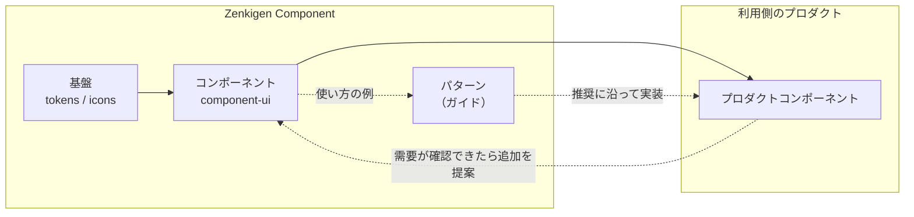
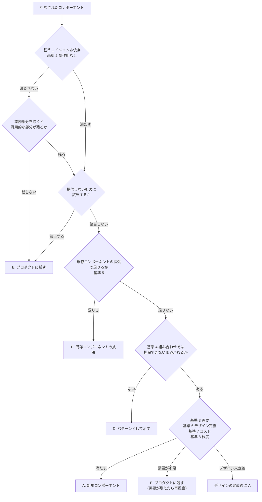

# コンポーネントの対象範囲と追加方針

このドキュメントでは、Zenkigen Component が提供するコンポーネントの範囲と、新しいコンポーネントや機能の追加を相談されたときの判断基準を定義しています。コンポーネントの作り方（Compound Component Pattern など）は [設計ガイドライン](./design-guidelines.md) を、既存 API を変更するときの扱いは [バージョン運用方針](./versioning-policy.md) を参照してください。

## 目次

- [基本方針](#基本方針)
- [4 つの層](#4-つの層)
- [提供するコンポーネント](#提供するコンポーネント)
  - [提供している種類](#提供している種類)
  - [提供しないもの](#提供しないもの)
- [粒度のルール](#粒度のルール)
- [既存コンポーネントで揃えていくこと](#既存コンポーネントで揃えていくこと)
- [追加の判断基準](#追加の判断基準)
- [判断の流れと結果](#判断の流れと結果)
- [提案の方法](#提案の方法)
- [関連リンク](#関連リンク)

## 基本方針

- **ドメインに依存しない UI 部品を提供する。** 業務の型・データ取得・ルーティング・固定の業務文言を持つ部品は、利用側のプロダクトに置く。
- **複数のプロダクトで需要が確認されてから追加する。** 一般的な UI コンポーネントライブラリにある種類でも、先回りしては追加しない。
- **相談された実装をそのまま取り込むのではなく、ライブラリとして設計し直す。** 利用側の実装は、そのプロダクトのレイアウトや要件を前提にしていることが多い。
- **API は最小から始め、要望が出てから足す。**
- 本ライブラリは npm で公開しており、社外にも利用者がいる。特定の業務に依存する部品は、社外の利用者には意味を持たないまま、破壊的変更の制約だけを等しく課すことになるため置かない。

## 4 つの層

| 層                           | 中身                                                                     | 置き場所                                                                   | 例                                                                   |
| ---------------------------- | ------------------------------------------------------------------------ | -------------------------------------------------------------------------- | -------------------------------------------------------------------- |
| **基盤**                     | デザイントークン、タイポグラフィ、アイコン                               | 本ライブラリ（`component-config` / `component-theme` / `component-icons`） | カラートークン、`typography-*`、`Icon` の SVG                        |
| **コンポーネント**           | ドメインに依存しない UI 部品                                             | 本ライブラリ（`component-ui`）                                             | Button、TextInput、Modal、Select、Combobox、DatePicker、Table、Toast |
| **パターン**                 | 既存コンポーネントの定型的な組み合わせ方（見た目・文言・振る舞いの推奨） | 本ライブラリは使い方の例とガイドを持つ。実装は利用側                       | 未保存の変更の確認、権限がないときの表示、ラベルと値の一覧           |
| **プロダクトコンポーネント** | 業務の型・データ取得・ルーティング・権限・固定の業務文言を持つ部品       | 利用側のプロダクト（**本ライブラリの範囲外**）                             | 業務データのカード、ファイル出力ボタン                               |

本ライブラリが部品として提供するのは「基盤」と「コンポーネント」です。「パターン」は部品ではなくガイドとして扱い、「プロダクトコンポーネント」は扱いません。

## 提供するコンポーネント

### 提供している種類

一般的な UI コンポーネントライブラリで標準的に提供される種類を中心に、業務アプリケーションの画面で繰り返し必要になる部品（並び替え、表示件数の選択など）を提供しています。

| 分類           | コンポーネント                                                                                                                                                                    |
| -------------- | --------------------------------------------------------------------------------------------------------------------------------------------------------------------------------- |
| 操作           | Button, IconButton, SortButton                                                                                                                                                    |
| 入力           | TextInput, PasswordInput, TextArea, Search, Checkbox, Radio, RadioCard, Toggle, SegmentedControl, Select, SelectSort, Combobox, DatePicker, TimePicker, FileInput, EvaluationStar |
| オーバーレイ   | Modal, Popover, Popup, Dropdown, Tooltip                                                                                                                                          |
| フィードバック | NotificationInline, Toast, Loading                                                                                                                                                |
| ナビゲーション | Tab, Breadcrumb, Pagination, PaginationSelect, Steps                                                                                                                              |
| データ表示     | Table, Avatar, AvatarGroup, Tag                                                                                                                                                   |
| 文字・区切り   | Heading, Divider                                                                                                                                                                  |
| 基盤           | Icon                                                                                                                                                                              |

### 提供しないもの

| 種類                                                                         | 理由                                                                                            |
| ---------------------------------------------------------------------------- | ----------------------------------------------------------------------------------------------- |
| レイアウト部品（Box / Stack / Grid / Container など）                        | 配置と余白は利用側の Tailwind CSS で組む（[粒度のルール](#粒度のルール) 1）                     |
| フォームの状態管理・送信・バリデーション                                     | React Hook Form などのフォームライブラリと組み合わせる前提とする                                |
| ソート・フィルタ・仮想スクロールなどを内蔵する高機能な表（データグリッド）   | 多機能で保守が重く、プロダクトごとの要件差が大きい。`Table` は表示の枠組みに留める              |
| グラフ・チャート                                                             | 可視化ライブラリの領域で、重い依存が増える                                                      |
| リッチテキストエディタ                                                       | 重い外部依存と、保存形式などプロダクトごとの判断が必要になる                                    |
| 業務特化の入力（階層選択、左右移動による選択、メンションなど）               | 特定の管理画面に特化しており、汎用性が低い                                                      |
| 画面単位の構成（アプリの骨格、サイドバー、ログイン画面、ダッシュボードなど） | 画面構成はプロダクトごとに異なり、部品より上の粒度にあたる                                      |
| 演出目的のアニメーション                                                     | トランジションは原則使用しない（[設計ガイドライン](./design-guidelines.md#トランジション方針)） |

## 粒度のルール

これまでに提供してきたコンポーネントの作り方を、ルールとしてまとめたものです。新しいコンポーネントや機能は、このルールに沿った形で設計します。

| #   | ルール                                                                                                                                                                                                                                                                       | 本ライブラリでの例                                                                                                                                                                     |
| --- | ---------------------------------------------------------------------------------------------------------------------------------------------------------------------------------------------------------------------------------------------------------------------------- | -------------------------------------------------------------------------------------------------------------------------------------------------------------------------------------- |
| 1   | **レイアウトと外側の余白は持たない。** 配置は利用側に任せる                                                                                                                                                                                                                  | margin 系の props を持つコンポーネントはない                                                                                                                                           |
| 2   | **受け取るのは自分自身の寸法まで。見た目を上書きする props は設けない。** 必要な場合はトークンやバリアントの追加で対応する                                                                                                                                                   | `width` / `maxWidth` を受け取るのは、幅が用途によって変わるもの（Select、Modal、Table など）に限る。Divider・Tooltip は仕様書で上書き用の props を設けないと明記している               |
| 3   | **値は利用側で管理する（controlled）。フォームの状態・送信・バリデーションは持たない**                                                                                                                                                                                       | 入力値は `value` / `onChange` で受け渡す。FileInput の形式・サイズ検証も、結果を `onError` で通知し、表示する文言は利用側が渡す                                                        |
| 4   | **ラベルと入力をまとめる Field ラッパーは持たない。** エラーと補足の表示は、各入力コンポーネントが `isError` とメッセージ用のサブコンポーネントで持つ。テキスト系の入力のラベルは、利用側が `<label>` で紐付ける                                                             | `TextInput.HelperMessage` / `TextInput.ErrorMessage` を子に置くと `aria-describedby` と `aria-invalid` が自動で設定される                                                              |
| 5   | **Compound Component にするのは、利用者が並べる構造があるときだけ**                                                                                                                                                                                                          | Modal（Header / Body / Footer）、Combobox（Input / List / Item）は Compound。構造が固定の SelectSort、Pagination は単一の props                                                        |
| 6   | **フォーカス管理・キーボード操作・位置計算・ARIA の関連付けなど、利用側で個別に作ると品質がばらつく部分を吸収する**                                                                                                                                                          | Combobox（キーボード操作・IME 確定・候補の表示位置）、DatePicker（タイムゾーン・フォーカス）、Popover（外側クリック・Esc・フォーカスの移動）                                           |
| 7   | **振る舞いの容器と見た目の容器を分ける**                                                                                                                                                                                                                                     | Popover は位置・閉じ方・フォーカスを担い、見た目は Popup が担う。DatePicker は Popover の上に作られている                                                                              |
| 8   | **文言は利用側から受け取る。** コンポーネントが持つのは、アクセシブル名と、機能と切り離せない操作ラベルだけ。文言は日本語で、多言語対応は現時点で予定していない                                                                                                              | Combobox の「一致する情報が見つかりません」、Toast の閉じるボタンの「閉じる」など                                                                                                      |
| 9   | **データ取得・非同期処理・永続化は持たない。** 読み込み中の表示を置くかどうかは利用側が決める                                                                                                                                                                                | Combobox は `isLoading` を持たず、`Combobox.Loading` を利用側が置く                                                                                                                    |
| 10  | **既存コンポーネントを組み合わせたコンポーネントは、次のいずれかを満たすときに提供する。** ・利用側で同じ組み合わせが繰り返し作られ、品質が揃っていない ・組み合わせの内側に守るべき約束事やアクセシビリティの配慮がある ・公開 API だけでは同じ見た目を作れない | TimePicker（時・分の Select の組み合わせと範囲の制御）、PasswordInput（TextInput の内部スロットを使う）。DatePicker と TimePicker を統合したコンポーネントは作らず、利用側で並べて使う |
| 11  | **API は最小から始め、要望が出てから足す**                                                                                                                                                                                                                                   | AvatarGroup のサブコンポーネントを render prop に統合、Combobox の API の縮小、TimePicker の `width` の削除                                                                            |

## 既存コンポーネントで揃えていくこと

粒度のルールに対して、既存のコンポーネントで揃っていない点です。例外として認めるのではなく、改善の対象として扱います。

**エラー表示（ルール 4）** — 入力コンポーネントのエラー表示を、`isError` とメッセージ用のサブコンポーネントに揃えます。

| コンポーネント                                  | 現在のエラー表示                                 | 揃える方向                                                                                 |
| ----------------------------------------------- | ------------------------------------------------ | ------------------------------------------------------------------------------------------ |
| TextInput / PasswordInput / TextArea / Combobox | `isError` ＋ `.ErrorMessage` ＋ `.HelperMessage` | 基準（このまま）                                                                           |
| DatePicker / TimePicker / RadioCard             | `isError` ＋ `.ErrorMessage`                     | `.HelperMessage` は要望が出たら追加する                                                    |
| Select                                          | `isError` のみ                                   | `.ErrorMessage` を追加する                                                                 |
| FileInput                                       | `isError` ＋ `errorMessages`（文字列の配列）     | サブコンポーネント方式に寄せるか、配列を残す理由（検証エラーが複数出る）を仕様書に明記する |
| Checkbox                                        | `color="error"`                                  | `isError` に寄せる                                                                         |
| Radio / Toggle                                  | なし                                             | 単体で持つか、グループ側で示すかを決める                                                   |

ラベルと必須マークは、引き続き利用側の `<label>` で記述します。書き方の推奨はパターンとして示します。

**アクセシビリティ（ルール 6・8）**

- キーボード操作に対応していないコンポーネント（Select、Dropdown、Tab）は、順次対応する。
- アイコンのみのボタンにアクセシブル名がないコンポーネントは、日本語のアクセシブル名を付ける。
- 英語で固定されているアクセシブル名（Breadcrumb、PaginationSelect）は、日本語に揃える。

## 追加の判断基準

新しいコンポーネントとして追加するには、次の 8 項目をすべて満たす必要があります。1 と 2 は前提条件で、満たさない場合はプロダクトコンポーネントとして扱います。

| #   | 基準                                                         | 満たしていると言える状態                                                                                                                                                     |
| --- | ------------------------------------------------------------ | ---------------------------------------------------------------------------------------------------------------------------------------------------------------------------- |
| 1   | **ドメインに依存しない**                                     | 業務の型や業務用語を、props にも文言にも持たない。どのプロダクトのどの画面でも意味が通る                                                                                     |
| 2   | **アプリケーションの文脈・副作用を持たない**                 | データ取得・API 呼び出し・ルーティング・認証や権限・永続化を内部に持たない。値とイベントは props で受け渡す                                                                  |
| 3   | **複数のプロダクトで需要がある**                             | 複数のプロダクトで、それぞれ独立に必要とされている。同じ実装のコピーで広がったものは 1 つと数える                                                                            |
| 4   | **既存コンポーネントの組み合わせでは担保できない価値がある** | [粒度のルール](#粒度のルール) 6 の難しさを吸収する、またはプロダクト間で見た目が揃っておらず部品にしないと仕様を統一できない。組み合わせのコンポーネントはルール 10 を満たす |
| 5   | **既存と重複しない**                                         | 既存コンポーネントへの props やバリアントの追加で足りる場合は、新規ではなく既存の拡張として扱う                                                                              |
| 6   | **デザインシステムとして仕様を定義できる**                   | ZENKIGEN デザインシステム（Figma）に定義がある、または定義の追加をデザインと合意できる                                                                                       |
| 7   | **保守と依存のコストに見合う**                               | 重い外部依存を新たに増やさない。多機能にしすぎず、プロダクトごとの差分は組み合わせ側で吸収できる                                                                             |
| 8   | **粒度のルールに沿った形にできる**                           | レイアウトを持たない（ルール 1）、見た目の上書きを前提にしない（ルール 2）、業務の文言を持たない（ルール 8）形に設計できる                                                   |

## 判断の流れと結果

判断の結果は「追加する／しない」の 2 択にはせず、ライブラリ側で受け取れる形を探します。

| 結果                            | 意味                                                                                  | ライブラリ側で行うこと                                 | 利用側で行うこと                                                     |
| ------------------------------- | ------------------------------------------------------------------------------------- | ------------------------------------------------------ | -------------------------------------------------------------------- |
| **A. 新規コンポーネント**       | 基準をすべて満たす                                                                    | 粒度のルールに沿って、ライブラリとして設計する         | 提供後に置き換える                                                   |
| **B. 既存コンポーネントの拡張** | 既存コンポーネントに props やバリアントを追加すれば解決する                           | 既存コンポーネントの機能追加として検討する             | 提供後に置き換える                                                   |
| **C. 基盤への追加**             | アイコンやトークンが足りない                                                          | `component-icons` やトークンに追加する                 | 独自の SVG や色の指定を置き換える                                    |
| **D. パターン**                 | 既存コンポーネントの定型的な組み合わせで足りる                                        | 組み合わせ方の例と推奨（文言、ボタンの種類など）を示す | 推奨に沿って実装する                                                 |
| **E. プロダクトに残す**         | ドメインに依存する、需要が 1 つのプロダクトに限られる、または提供しないものに該当する | なし（判断基準をもとに理由を伝える）                   | プロダクト内で保持する。本ライブラリのコンポーネントとトークンで作る |

## 提案の方法

新しいコンポーネントや機能の追加は、実装を始める前に GitHub の issue で相談してください。次の情報があると判断しやすくなります。

- どのような UI・振る舞いか（スクリーンショット、該当するコード）
- どの画面で何か所使っているか
- 他のプロダクトでも同じものが必要とされているか（基準 3）
- ZENKIGEN デザインシステムに定義があるか（基準 6）
- 既存のコンポーネントで足りない点は何か（基準 5）

メンテナーは基準 1〜8 に沿って判断し、A〜E のいずれかを回答します。E の場合も、該当する基準を示して理由を伝えます。

## 関連リンク

- [設計ガイドライン](./design-guidelines.md) — Compound Component Pattern・アイコン・トランジションの方針
- [コンポーネント実装パターン](./component-patterns.md) — 実装パターン
- [コンポーネント仕様書テンプレート](./component-specification-template.md) — 新規コンポーネントの仕様書
- [バージョン運用方針](./versioning-policy.md) — 破壊的変更の扱い
