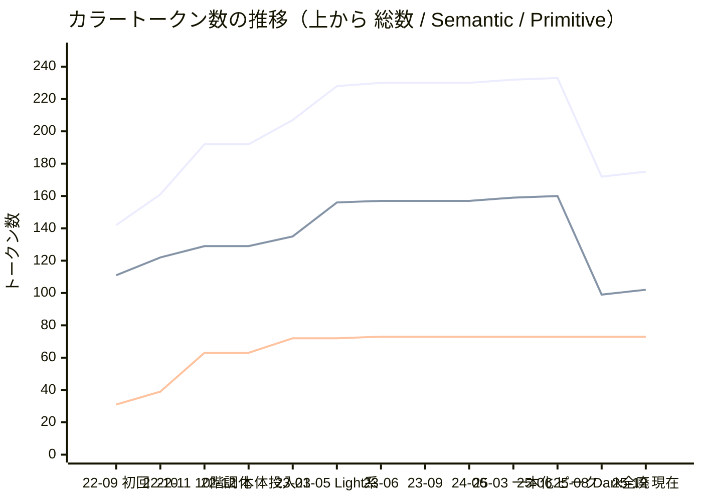

# カラートークン棚卸し 調査資料

semantic カラートークンの棚卸しタスクのための調査資料。**入口は「使われていないトークンの削除」**。
**トークンの変遷（追加・削除の履歴）** と **使用実態監査** を統合し、(1) 実装上どこからも使われていないトークンの特定と、(2) それ以上の削減を目指す場合に何が必要かを示す。

- **対象**: `packages/component-config/style-dictionary/tokens.json` の `zen` テーマ（カラートークンのみ。タイポグラフィ・Shadow は対象外）
- **調査日**: 履歴調査 2026-06-12 / 使用実態監査 v2 2026-06-10
- **出典**: 両リポジトリ（本体・旧 design-tokens）の git 履歴、`tmp/color-token-consolidation/`（監査レポート・再現スクリプト）

---

## 結論（TL;DR）

1. **現在のカラートークンは 175 個**（Primitive 73 ＋ Semantic 102。Semantic の内訳は `Tokens` 配下 82 ＋ User カラー 20）
2. **大規模な削減は既に一度実施済み**。2025-08 の「ダークモードトークン 61 件全廃」（PR #434）で、ピーク 233 → 172 まで減少している
3. **入口 — 未使用トークンの削除**: 使用実態監査の結果、実装上どこからも使われていない（TRUE DEAD）のは **semantic 82 のうち 16 個**。うち 14 個は 2022-09 の初回投入時から **3 年以上一度も実装で使われていない**。これを削除すると 82 → **66 個**
4. **それ以上の削減を目指す場合**: lib 実装内でのみ使われる 24 個のうち「明確な過剰分割」を集約する余地があり、4〜8 個程度減らせれば **約 58〜62 個**。ただし同値でも意味が異なるものは将来の分岐に備えた意図的な間接化であり、統合の可否は個別判断が必要
5. **そこから先は困難**: 残る 42 個は利用側アプリの実装で使用中。削除・改名は破壊的変更となり移行表とアプリ側の改修が必要。半減のようなドラスティックな削減は現実的でない

---

## 1. トークン数の変遷（履歴）

### 推移チャート



※ mermaid の xychart は凡例を表示しないため、系列は値の大小で判別する（常に 総数 ＞ Semantic ＞ Primitive）。Semantic = `Tokens` 配下＋ User カラー（Storybook `Tokens/Color` の分類に準拠）。

### 主要な増減イベント

| 時期        | イベント                                                                                                      | 増減                      | 背景                                                                                                 |
| ----------- | ------------------------------------------------------------------------------------------------------------- | ------------------------- | ---------------------------------------------------------------------------------------------------- |
| 2022-09     | 初回投入（旧 design-tokens リポジトリ、Token Studio 形式）                                                    | 142 (P31/S111)            | Figma からの初回エクスポート。**ライト/ダーク両対応の体系**で、link 状態系・field 系など網羅的に定義 |
| 2022-10〜11 | プリミティブ 10 階調化、Toggle 用トークン追加→廃止（DisabledOn 系へ集約）                                     | → 192 (P63/S129)          | カラースケールの統一。早くも「専用トークンの過剰分割→集約」を経験                                    |
| 2022-12     | 本体リポジトリへ投入（PR #3）。以後 2 ファイル並行管理                                                        | 192                       | リポジトリ初期構築                                                                                   |
| 2023 前半   | Purple 階調・InteractiveBg01・Light 系（User Light 10 ＋ Support Light 5）等を追加                            | → 230 (P73/S157)          | Tag light バリアント等、コンポーネント実装と対で拡充                                                 |
| 2023-09     | Gray70 刷新（`#6F7476`）                                                                                      | 数は不変                  | アクセシビリティ（コントラスト）対応の始まり                                                         |
| 2025-03     | design-tokens 側が管理終了を宣言、本体へ一本化。UiBorder04 / Interactive04 追加                               | → 232                     | 管理の一元化                                                                                         |
| 2025-06     | HoverGray 追加                                                                                                | **233（ピーク）**         | Toggle の hover 仕様対応                                                                             |
| 2025-08     | **ダークモードトークン 61 件全廃**（PR #434）                                                                 | **→ 172**                 | ライトモードのみサポートへ方針変更。未使用トークンの最初の大整理                                     |
| 2025-09〜12 | WCAG 対応で基準色刷新（Gray100 / Blue50 / Red60 / Green60）、SelectedUiDark・HoverUiError・ActiveUiError 追加 | → **175 (P73/S102)** 現在 | 数の増減より「値の品質」のフェーズへ                                                                 |

> コミット単位の完全な履歴（全 124 コミット、PR 文脈付き）はワークスペースの `docs/tokens-history.md` を参照（リポジトリ外の調査ドキュメント）。

---

## 2. 使用実態監査（v2、2026-06-10）

対象: semantic 82 トークン（`Tokens` 配下。User カラー 20 は棚卸し対象外）。範囲: library（component-ui ＋ component-theme）実装 ＋ 利用側 7 アプリの実装。
再現: `node tmp/color-token-consolidation/token-audit.mjs`

### 手法の要点

- **クラス文脈で検出**（`bg-` / `text-` / `outline-` 等の接頭辞＋トークン名）。素朴な grep による過大カウント（v1）を codex レビューで修正（例: `focus` は v1 で 211 件 → 実際は 5 件）
- runtime 実装と test / story / docs / config(safelist) を**別集計**し、「実使用」から除外

### サマリー

| 分類                                        |     数 | 意味                                   |
| ------------------------------------------- | -----: | -------------------------------------- |
| **TRUE DEAD**（lib 実装 0 ＆ 利用側実装 0） | **16** | 削除候補（実装上どこからも使われない） |
| lib 実装のみ（利用側実装 0）                |     24 | 利用側移行なしで集約・改名可           |
| 利用側実装で使用                            |     42 | 削除・改名は破壊的（移行表が必要）     |

### カテゴリ別

| カテゴリ    |   総数 | lib使用 | 利用側使用 |   DEAD | DEAD トークン                                                        |
| ----------- | -----: | ------: | ---------: | -----: | -------------------------------------------------------------------- |
| text        |      6 |       4 |          6 |      0 | —                                                                    |
| link        |      2 |       1 |          1 |      1 | `link02`                                                             |
| border      |      4 |       4 |          2 |      0 | —                                                                    |
| background  |     12 |       9 |          9 |      1 | `backgroundOverlayGray`                                              |
| icon        |      4 |       4 |          4 |      0 | —                                                                    |
| interactive |      5 |       3 |          2 |      2 | `interactiveBg01`, `interactive03`                                   |
| field       |      2 |       0 |          0 |  **2** | `fieldInput`, `fieldSearch`（**カテゴリ丸ごと未使用**）              |
| focus       |      1 |       1 |          0 |      0 | —                                                                    |
| hover       |     14 |      10 |          4 |      4 | `hover02Background`, `hoverSelectedUi`, `hoverLink01`, `hoverLink02` |
| active      |     10 |       8 |          4 |      1 | `activeLink01`                                                       |
| selected    |      5 |       2 |          3 |      2 | `selectedUiGray`, `selectedUiOnColor`                                |
| disabled    |      7 |       3 |          2 |      3 | `disabled04`, `disabledLink01`, `disabledLink02`                     |
| support     |     10 |      10 |          5 |      0 | —                                                                    |
| **合計**    | **82** |  **59** |     **42** | **16** |                                                                      |

- `text` / `icon` / `border` / `support` は DEAD 0 で lib・利用側ともに使用 ＝ 中核（迂闊に触らない）
- `hover`（14 個）は利用側では 4 個しか使われておらず、lib 内での集約余地が大きい

---

## 3. 履歴 × 監査のクロス分析 — DEAD 16 はいつ生まれたか

TRUE DEAD 16 トークンの初出を git 履歴で特定した結果:

| DEAD トークン                                                                                                       | 初出                 | 経緯                                                                                       |
| ------------------------------------------------------------------------------------------------------------------- | -------------------- | ------------------------------------------------------------------------------------------ |
| `link02`, `hoverLink01`, `hoverLink02`, `activeLink01`, `disabledLink01`, `disabledLink02`                          | **2022-09 初回投入** | link の状態系一式。`link01` 以外は一度も実装で使われず                                     |
| `fieldInput`, `fieldSearch`                                                                                         | **2022-09 初回投入** | field カテゴリ丸ごと。`uiBackground01` と同義のまま未使用                                  |
| `hover02Background`, `hoverSelectedUi`, `selectedUiOnColor`, `backgroundOverlayGray`, `interactive03`, `disabled04` | **2022-09 初回投入** | 既存トークンと同義の細分化。`interactive03` / `disabled04` は stories でのみ参照           |
| `selectedUiGray`                                                                                                    | 2022-11-01 追加      | 背景・選択状態の拡充時に追加されたが未使用に                                               |
| `interactiveBg01`                                                                                                   | 2023-01-31 追加      | 「fill ボタン背景を Interactive01 から分離」する目的で追加されたが、実装では使われないまま |

**わかること**:

- DEAD 16 のうち **14 個（88%）は初回投入時の Figma エクスポートに含まれていた網羅的定義**で、3 年以上一度も実装に登場していない。「運用の中で使われなくなった」のではなく「**最初から使われなかった**」
- 逆に、コンポーネント実装と対で後から追加されたトークン（Light 系、HoverGray、UiBorder03 など）はほぼ使われている。**追加の規律は機能していた**
- 過剰分割→集約のパターンは 2022-11 の Toggle トークン廃止（6 種 → DisabledOn 系 2 種）で前例があり、今回の Tier 2 集約はその延長線上にある

---

## 4. 実施の入口と、さらなる削減の選択肢

| 段階                         | 対象                                                                                                            |  数 | 扱い                                                                                                                             |
| ---------------------------- | --------------------------------------------------------------------------------------------------------------- | --: | -------------------------------------------------------------------------------------------------------------------------------- |
| **入口: 未使用の削除**       | TRUE DEAD（上表 16 個）                                                                                         |  16 | **削除**。利用側 0 のため低リスク。`interactive03` / `disabled04` 削除時は `icon.stories.tsx` の更新も必要                       |
| **さらに削減するなら: 集約** | lib 実装のみ（`uiBorder03` / `hoverUi02` / `interactive04` / `hoverError` / `hoverGray` / Support Light 系 等） |  24 | **集約検討**。利用側移行なしで library 内だけで整理可。ただし「同値でも意味が別」のものは維持（例: `focus` は実装 5 使用で維持） |
| **削減対象にしない**         | 利用側実装で使用                                                                                                |  42 | **残す**。手を付けると破壊的変更（改名する場合のみ移行表を用意）                                                                 |

- 純減見込み: 未使用 16 個の削除で **82 → 66**。集約は 24 個の全廃ではなく「明確な過剰分割」のみが対象で、4〜8 個程度減らせれば **約 58〜62**
- トークンは公開 API（`bg-interactive01` 等の Tailwind クラス）であり、削除・改名は破壊的変更となる点に注意

### 集約の進め方（5 ステップ）

未使用削除と違い、集約は「機械的に消す」ことができない。同じ色値でも役割が異なるトークンを誤って統合すると、将来デザインが分岐したときに戻せなくなる。以下の手順で進める:

1. **同値グループの抽出**（機械的）— Tier 2 の 24 個を、参照する primitive 値でグルーピングする（結果は下表。再現は末尾の「付録」スクリプト）
2. **使用箇所の列挙**（機械的）— 各トークンが library 内のどのコンポーネント・どの状態で使われているかを `grep` で列挙する
3. **デザイン意図の確認**（デザイナーと、ここが本体）— 同値の相手と「使い分ける意図」があるかをグループごとに判断する
   - 意図がある（役割が別で、将来別の色に分岐しうる）→ **維持**
   - 意図がない（たまたま同値・命名の重複・過剰分割）→ **統合先を決定**
4. **置換・削除**（機械的）— library 内の参照を統合先トークンへ置換 → `tokens.json` から削除 → `yarn update-tokens && yarn build:all` → Chromatic で視覚回帰が 0 件であることを確認（同値統合なら見た目は変わらないはず）
5. **Figma Variables 側の同期** — コード側だけ削除すると、Figma には同名 Variable が残り、次の Figma 同期やデザイナーの新規デザインで復活・乖離する。**デザイン側の削除とセットで実施する**

### 集約候補の同値グループ（ステップ 1 の実データ、2025-12 時点）

Tier 2 トークンが属する同値グループ。「統合可否」はステップ 3 でデザイナーが判断するものであり、ここでは判断材料となる観点のみ示す:

| Primitive 値 | 同値トークン（DEAD 16 削除後）                                                                                                             | 観点                                                                                               |
| ------------ | ------------------------------------------------------------------------------------------------------------------------------------------ | -------------------------------------------------------------------------------------------------- |
| Red70        | **hoverError** ＋ hoverDanger（使用中）                                                                                                    | 同カテゴリ・同値で役割も近い。**統合の有力候補**（error / danger の使い分け意図の確認のみ）        |
| Gray70       | **hoverInput** ＋ **hoverUiBorder**                                                                                                        | 両方 Tier 2 同士。input border の hover と ui border の hover — どちらかに寄せられる可能性が高い   |
| #F4BFCD      | **supportErrorLight** ＋ **supportDangerLight**                                                                                            | 値が同じ error / danger の二重定義。Support 系の error / danger 体系の整理と合わせて判断           |
| Gray10       | **hoverUi02**・**disabled02** ＋ uiBackground02・uiBackgroundGray（使用中）                                                                | 同値だが hover / disabled / background は役割が異なる。**安易な統合は不可**、命名整理の余地のみ    |
| Gray40       | **active02**・**interactive04** ＋ icon03・uiBorder02（使用中）                                                                            | 同上（状態系と border 系の混在）                                                                   |
| Blue50       | **focus** ＋ interactive01・link01 ほか（使用中）                                                                                          | フォーカスリングは独立した役割で実装 5 箇所使用。**維持**                                          |
| （単独値）   | **supportInfoLight** / **supportSuccessLight** / **supportWarningLight** / **activeUiError** / **active01** / **uiBackgroundWarning** など | 同値の相手がいないため「集約」はできない。役割として必要かの要否判断（不要なら削除、必要なら維持） |

### 利用側で使用中の 42 個に手を付ける場合（非推奨）

削減対象にはしないが、命名整理等でどうしても変更する場合の手順だけ記しておく: `@deprecated` 周知 → 新旧対応の移行表を作成 → 利用側 7 アプリの置換（grep ベースで機械的に可能）→ メジャーバージョンで旧トークン削除。コストに対して得られるものが少ないため、明確なデザイン上の理由がない限り推奨しない。

### 注意（監査の限界）

- 「DEAD」の判定範囲は**追跡中の 7 アプリ＋ library 実装**。クローン外の社内アプリでの利用は未検出 → 削除前に台帳確認 or `@deprecated` 周知を推奨
- `Icon` は `fill-${color}` を動的生成するため、prop 経由でどのトークンも実行時利用されうる（静的カウントの限界）

---

## 付録: 同値グループの再現スクリプト

```bash
python3 -c "
import json
from collections import defaultdict
zen = json.load(open('packages/component-config/style-dictionary/tokens.json'))['zen']
groups = defaultdict(list)
for cat, items in zen['Tokens'].items():
    for name, d in items.items():
        if isinstance(d, dict) and 'value' in d:
            groups[d['value']].append(name[0].lower() + name[1:])
for ref, names in sorted(groups.items()):
    if len(names) > 1:
        print(f'{ref}: ' + ', '.join(sorted(names)))"
```

---

## 出典・関連資料

※ `tmp/` 配下は git 管理外のローカル調査ファイルのため、リポジトリ上からは参照できない（調査実施者のローカル環境にのみ存在）。

| 資料                                               | 場所                                                                                    |
| -------------------------------------------------- | --------------------------------------------------------------------------------------- |
| 使用実態監査レポート v2（手法詳細・Tier 全リスト） | `tmp/color-token-consolidation/audit-report.md`（git 管理外）                           |
| 監査再現スクリプト                                 | `tmp/color-token-consolidation/token-audit.mjs` / `token-by-category.mjs`（git 管理外） |
| トークン変遷の完全履歴（全コミット・PR 文脈付き）  | 調査用ワークスペースの `docs/tokens-history.md`（リポジトリ外）                         |
