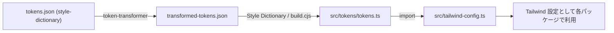

# @zenkigen-inc/component-config

コンポーネント設定パッケージ。カラートークンやその他の設定を管理します。

## 開発者向け

### カラートークンの更新

カラートークンを更新するには、以下の手順に従ってください：

1. 以下のJSONファイルを編集します：

   ```
   packages/component-config/style-dictionary/tokens.json
   ```

2. 変更を適用するために、ビルドコマンドを実行します：

   ```bash
   yarn build:tokens
   ```

   このコマンドを実行すると、差分が表示され結果を確認できます。

3. tailwindに反映させ、zenkigen-component全体で使用できるようにします：（プロジェクトのルートで実行）
   ```bash
   yarn build:all
   ```

### トークン生成フロー



- マスターデータ: `packages/component-config/style-dictionary/tokens.json`
- `yarn build:tokens` 実行時に以下が順に生成されます
  1. `token-transformer` が `style-dictionary/tokens.json` を読み取り、`style-dictionary/transformed-tokens.json` を作成
  2. `build.cjs` が Style Dictionary で `transformed-tokens.json` を読み込み、ローワーキャメルのキーで `src/tokens/tokens.ts` を生成（`export const tokens = ... as const` と `export const tokensWithMeta = ... as const` を出力）
- `src/tailwind-config.ts` で生成済み `tokens` を読み込み、`tailwindConfig.theme.extend.colors` などに展開し Tailwind の設定として利用します。

#### 主なファイルとフォーマット

| ファイル                                   | 役割              | フォーマット/生成元                                                                                                    | 備考                                          |
| ------------------------------------------ | ----------------- | ---------------------------------------------------------------------------------------------------------------------- | --------------------------------------------- |
| `style-dictionary/tokens.json`             | マスタートークン  | 手書きの JSON（Style Dictionary + token-transformer 記法、`$Colors.*` 参照可）                                         | カラーやタイポなどのソース。                  |
| `style-dictionary/transformed-tokens.json` | 変換済みトークン  | `yarn build:tokens` 内の `token-transformer` が生成。全ての参照が解決され HEX 等の生値を保持                           | Style Dictionary の入力。                     |
| `src/tokens/tokens.ts`                     | TypeScript 用定数 | `build.cjs`（Style Dictionary の `customTSFormat`）が生成。ローワーキャメルキーで `export const tokens = ... as const` と `export const tokensWithMeta = ... as const` を出力 | `tokens` は値のみで Tailwind 用互換を維持。`tokensWithMeta` で description/type を含むメタ情報を参照可能。 |
| `src/tailwind-config.ts`                   | Tailwind 設定     | 上記 `tokens.ts` を読み込み `tailwindConfig.theme.extend` に展開                                                       | Yarn ワークスペース全体で共通設定として利用。 |

## ライセンス

@zenkigen-inc/component-config は MIT ライセンスに基づいています。
