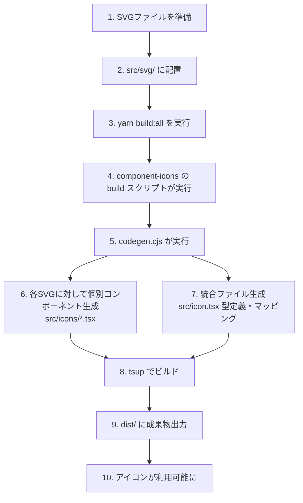
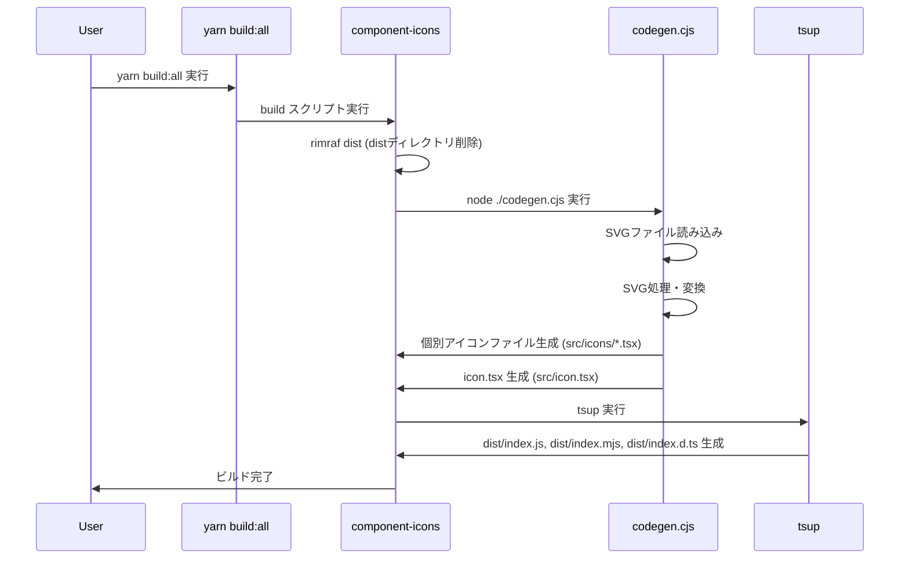

# アイコン追加ワークフロー

このドキュメントは、`@zenkigen-inc/component-icons` パッケージにおけるアイコンの追加から利用可能になるまでの詳細なプロセスを説明します。

## 目次

1. [概要](#概要)
2. [アイコン追加の手順](#アイコン追加の手順)
3. [ビルドプロセスの詳細](#ビルドプロセスの詳細)
4. [コード生成の詳細](#コード生成の詳細)
5. [生成されるファイルとディレクトリ構造](#生成されるファイルとディレクトリ構造)
6. [トラブルシューティング](#トラブルシューティング)

---

## 概要

アイコンの追加は以下の3つのステップで構成されます：

1. **手動作業**: SVGファイルを指定ディレクトリに配置
2. **ビルド実行**: `yarn build:all` コマンドを実行
3. **自動生成**: `codegen.cjs` がTSXファイルと型定義を自動生成



---

## アイコン追加の手順

### 1. SVGファイルの準備

#### 基本要件

- **サイズ**: 24x24サイズを推奨
- **命名規則**: kebab-case（例: `arrow-right.svg`、`calendar-today.svg`）
- **フォーマット**: 標準的なSVG形式

#### 通常のSVGアイコン形式

```svg
<svg width="24" height="24" viewBox="0 0 24 24" fill="none" xmlns="http://www.w3.org/2000/svg">
  <path fill-rule="evenodd" clip-rule="evenodd"
        d="M11.276 12.724H4.72399C4.3258 12.724 4 12.3982 4 12C4 11.6018 4.3258 11.276 4.72399 11.276H11.276V4.72398C11.276 4.32579 11.6018 4 12 4C12.3982 4 12.724 4.32579 12.724 4.72398V11.276H19.276C19.6742 11.276 20 11.6018 20 12C20 12.3982 19.6742 12.724 19.276 12.724H12.724V19.276C12.724 19.6742 12.3982 20 12 20C11.6018 20 11.276 19.6742 11.276 19.276V12.724Z"
        fill="#7C868A"/>
</svg>
```

> **注意**: `fill`、`stroke`、`width`、`height`などの属性は後の処理で削除されます。

#### アクセントカラー対応SVGアイコン形式

アクセントカラー機能を使用する場合、異なる色を適用したい要素に `class="accent"` を追加します：

```svg
<svg width="24" height="24" viewBox="0 0 24 24" fill="none" xmlns="http://www.w3.org/2000/svg">
  <!-- 基本形状（通常の色） -->
  <path d="M19 4H5C3.89543 4 3 4.89543 3 6V20C3 21.1046 3.89543 22 5 22H19C20.1046 22 21 21.1046 21 20V6C21 4.89543 20.1046 4 19 4Z"
        fill="#7C868A"/>

  <!-- アクセントカラーを適用する要素 -->
  <circle class="accent" cx="12" cy="12" r="3" fill="#FF0000"/>
</svg>
```

**アクセントカラーのポイント**:

- `class="accent"` を追加した要素は、後の処理で `className={accentClassName}` に変換されます
- 複数の要素に適用可能
- Icon コンポーネントの `accentColor` プロパティで動的に色を変更できます

### 2. SVGファイルの配置

準備したSVGファイルを以下のディレクトリに配置します：

```
packages/component-icons/src/svg/
```

**配置例**:

```
packages/component-icons/
├── src/
│   ├── svg/
│   │   ├── add.svg           ← 新規追加
│   │   ├── arrow-right.svg   ← 既存
│   │   ├── calendar-today.svg ← 既存（アクセントカラー対応）
│   │   └── ...
│   ├── icons/               （自動生成されるディレクトリ）
│   ├── icon.tsx             （自動生成されるファイル）
│   └── index.ts
```

### 3. ビルド実行

プロジェクトルートで以下のコマンドを実行します：

```bash
yarn build:all
```

このコマンドは、ルートの `package.json` に定義されています：

```json
{
  "scripts": {
    "build:all": "yarn workspaces foreach --all -pt --exclude zenkigen-component run build"
  }
}
```

**実行内容**:

- すべてのワークスペース（`packages/*`）に対して `build` スクリプトを並列実行
- `component-icons` の場合、以下のスクリプトが実行されます：

```json
{
  "scripts": {
    "generate": "node ./codegen.cjs",
    "build": "rimraf dist && yarn generate && tsup"
  }
}
```

**ビルドステップ**:

1. `rimraf dist` - 既存の `dist` ディレクトリを削除
2. `yarn generate` - `codegen.cjs` を実行（コード生成）
3. `tsup` - TypeScriptファイルをビルドして `dist` に出力

---

## ビルドプロセスの詳細

### component-icons の build スクリプト

`packages/component-icons/package.json` で定義されている `build` スクリプト：

```json
{
  "scripts": {
    "generate": "node ./codegen.cjs",
    "build": "rimraf dist && yarn generate && tsup",
    "build-lib": "rimraf dist && yarn generate && tsup"
  }
}
```

### ビルドの流れ



---

## コード生成の詳細

### codegen.cjs の処理フロー

`packages/component-icons/codegen.cjs` は以下の処理を実行します：

#### 1. SVGファイルの読み込み

```javascript
const files = glob.sync('./src/svg/*.svg');
console.log(`Processing ${files.length} SVG files...`);
```

- `src/svg/` 配下のすべてのSVGファイルを検索
- バッチ処理（10ファイルずつ）で効率的に処理

#### 2. SVGファイルの処理 (`processSvgFile` 関数)

各SVGファイルに対して以下の変換を実行：

```javascript
async function processSvgFile(file) {
  const content = fs.readFileSync(file).toString('utf8');
  const $ = cheerio.load(content, {
    decodeEntities: false,
  });

  const key = path.basename(file, '.svg');

  // 不要な要素・属性の削除
  $('style,title,defs').remove();
  $('[id]:not(symbol)').removeAttr('id');
  $('[class^="st"],[class^="cls"]').removeAttr('class');
  $('[style]:not(svg)').removeAttr('style');
  $('[data-name]').removeAttr('data-name');
  $('svg[id]').removeAttr('id');
  $('[fill]').removeAttr('fill');
  $('[stroke]').removeAttr('stroke');
  $('[width]').removeAttr('width');
  $('[height]').removeAttr('height');

  // アクセントカラー対応の特別処理
  $('[class="accent"]').attr('className', '{accentClassName}').removeAttr('class');

  // アクセシビリティ属性の追加
  const escapedKey = $('<div>').text(key).html();
  $('svg').attr('role', 'img').attr('aria-label', escapedKey);

  // React用の変換
  const value = $.xml('svg')
    .replaceAll('"{', '{')
    .replaceAll('}"', '}')
    .replaceAll(/\bclass=/g, 'className=')
    .replaceAll(/(?<!aria)[-]([a-z])/g, (_, x) => x.toUpperCase());

  return { key, value };
}
```

**削除される属性**:

| 属性/要素                            | 理由                        |
| ------------------------------------ | --------------------------- |
| `style`, `title`, `defs`             | 不要なスタイル情報          |
| `id`                                 | コンポーネント化により不要  |
| `class`（`st*`, `cls*`で始まるもの） | SVGエディタの自動生成クラス |
| `data-name`                          | メタデータ属性              |
| `fill`, `stroke`                     | Reactで動的に制御するため   |
| `width`, `height`                    | サイズはCSSで制御           |

**追加される属性**:

| 属性         | 値                       | 目的                   |
| ------------ | ------------------------ | ---------------------- |
| `role`       | `"img"`                  | アクセシビリティ       |
| `aria-label` | ファイル名（拡張子なし） | スクリーンリーダー対応 |

**特別な変換**:

- `class="accent"` → `className={accentClassName}`
  - アクセントカラー機能を実現
- `class` → `className`（React対応）
- kebab-case → camelCase（HTML属性のReact変換）

#### 3. 個別アイコンファイルの生成 (`generateIconFile` 関数)

各SVGに対して個別のTSXファイルを生成：

```javascript
function generateIconFile(key, value) {
  const componentName = `${key.replace(/[-\s]/g, '')}Icon`;

  return `/*
* NOTE: This file is auto generated
* Do not edit manually.
*/
import React from 'react';

export interface ${componentName}Props {
  accentClassName?: string;
}

export const ${componentName}: React.FC<${componentName}Props> = ({ accentClassName }) => (
  ${value}
);
`;
}
```

**生成例** (`calendar-today.svg` の場合):

```tsx
/*
 * NOTE: This file is auto generated
 * Do not edit manually.
 */
import React from 'react';

export interface calendartodayIconProps {
  accentClassName?: string;
}

export const calendartodayIcon: React.FC<calendartodayIconProps> = ({ accentClassName }) => (
  <svg role="img" aria-label="calendar-today" xmlns="http://www.w3.org/2000/svg" viewBox="0 0 24 24">
    <path d="M19 4h-1V3c0-.55-.45-1-1-1s-1 .45-1 1v1H8V3c0-.55-.45-1-1-1s-1 .45-1 1v1H5c-1.11 0-1.99.9-1.99 2L3 20c0 1.1.89 2 2 2h14c1.1 0 2-.9 2-2V6c0-1.1-.9-2-2-2z" />
    <circle className={accentClassName} cx="12" cy="12" r="3" />
  </svg>
);
```

ファイルは `src/icons/${key}.tsx` に保存されます。

#### 4. メインicon.tsxファイルの生成

`template.ejs` を使用して `src/icon.tsx` を生成：

```ejs
/*
* NOTE: This class is auto generated by /zenkigen/workplace-frontend/packages/component-icon
* Do not edit the class manually.
*/
import type React from 'react';

export type IconName = <%- [...result].reverse().map(({ key }) => `'${key}'`).join(' | ') %>;

export type IconComponent = React.FC<{ accentClassName?: string }>;

// Import all icon components
<% [...result].reverse().forEach(({ key }) => { %>
import { <%- key.replace(/[-\s]/g, '') %>Icon } from './icons/<%- key %>';
<% }) %>

// Icon elements mapping
export const iconElements = {
  <% [...result].reverse().forEach(({ key }) => { %>
    '<%- key %>': <%- key.replace(/[-\s]/g, '') %>Icon,
  <% }) %>
};
```

**生成される内容**:

1. **型定義 `IconName`**: すべてのアイコン名のUnion型

   ```typescript
   export type IconName = 'add' | 'arrow-right' | 'calendar-today' | ...;
   ```

2. **すべてのアイコンコンポーネントのimport**:

   ```typescript
   import { addIcon } from './icons/add';
   import { arrowrightIcon } from './icons/arrow-right';
   import { calendartodayIcon } from './icons/calendar-today';
   // ...
   ```

3. **iconElementsマッピングオブジェクト**:
   ```typescript
   export const iconElements = {
     add: addIcon,
     'arrow-right': arrowrightIcon,
     'calendar-today': calendartodayIcon,
     // ...
   };
   ```

#### 5. tsup によるビルド

生成されたTSXファイルを `tsup` でビルド：

```bash
tsup
```

**出力ファイル**:

```
dist/
├── index.js         # CommonJS形式
├── index.mjs        # ESModule形式
├── index.d.ts       # TypeScript型定義（CommonJS用）
└── index.d.mts      # TypeScript型定義（ESModule用）
```

---

## 生成されるファイルとディレクトリ構造

### ビルド前

```
packages/component-icons/
├── src/
│   ├── svg/
│   │   ├── add.svg
│   │   ├── arrow-right.svg
│   │   └── calendar-today.svg
│   └── index.ts
├── codegen.cjs
├── template.ejs
├── package.json
└── tsconfig.json
```

### コード生成後（yarn generate 実行後）

```
packages/component-icons/
├── src/
│   ├── svg/
│   │   ├── add.svg
│   │   ├── arrow-right.svg
│   │   └── calendar-today.svg
│   ├── icons/                       ← 生成
│   │   ├── add.tsx                  ← 生成
│   │   ├── arrow-right.tsx          ← 生成
│   │   └── calendar-today.tsx       ← 生成
│   ├── icon.tsx                     ← 生成
│   └── index.ts
```

### ビルド完了後（yarn build 実行後）

```
packages/component-icons/
├── src/
│   ├── svg/
│   │   ├── add.svg
│   │   ├── arrow-right.svg
│   │   └── calendar-today.svg
│   ├── icons/
│   │   ├── add.tsx
│   │   ├── arrow-right.tsx
│   │   └── calendar-today.tsx
│   ├── icon.tsx
│   └── index.ts
├── dist/                            ← 生成
│   ├── index.js                     ← 生成
│   ├── index.mjs                    ← 生成
│   ├── index.d.ts                   ← 生成
│   └── index.d.mts                  ← 生成
├── codegen.cjs
├── template.ejs
├── package.json
└── tsconfig.json
```

---

## アイコンの利用

### 1. Icon コンポーネントでの利用（推奨）

```tsx
import { Icon } from '@zenkigen-inc/component-ui';

// 通常のアイコン
<Icon name="add" size="medium" color="icon01" />

// アクセントカラー対応アイコン
<Icon
  name="calendar-today"
  size="medium"
  color="icon01"
  accentColor="interactive01"
/>
```

### 2. 直接インポートして利用

```tsx
import { iconElements } from '@zenkigen-inc/component-icons';

// アイコン要素を直接表示
<div>{iconElements['add']}</div>;
```

### 型安全性

追加したアイコンは自動的に `IconName` 型に含まれます：

```typescript
// ✅ 正しい: 存在するアイコン名
<Icon name="add" />
<Icon name="calendar-today" />

// ❌ エラー: 存在しないアイコン名
<Icon name="non-existent-icon" /> // TypeScriptコンパイルエラー
```

---

## トラブルシューティング

### アイコンが表示されない

**原因**: ビルドが正しく実行されていない

**解決方法**:

```bash
# component-icons パッケージのみ再ビルド
cd packages/component-icons
yarn build

# または、すべてのパッケージを再ビルド
cd ../../
yarn build:all
```

### 型定義が更新されない

**原因**: IDEがキャッシュしている古い型情報を使用している

**解決方法**:

1. VSCodeの場合: TypeScriptサーバーを再起動
   - コマンドパレット（Cmd+Shift+P）を開く
   - "TypeScript: Restart TS Server" を実行

2. ビルドを再実行:
   ```bash
   yarn build:all
   ```

### SVGファイルが認識されない

**原因**: ファイルが正しいディレクトリに配置されていない、または拡張子が `.svg` ではない

**確認項目**:

- ファイルパス: `packages/component-icons/src/svg/your-icon.svg`
- 拡張子: `.svg`（小文字）
- ファイル名: kebab-case推奨（例: `my-icon.svg`）

**解決方法**:

```bash
# SVGファイルの配置を確認
ls packages/component-icons/src/svg/

# ファイルが存在する場合は再ビルド
yarn build:all
```

### アクセントカラーが適用されない

**原因**: SVGファイルに `class="accent"` が設定されていない

**確認方法**:

1. 元のSVGファイル（`src/svg/*.svg`）を確認
2. アクセントカラーを適用したい要素に `class="accent"` が設定されているか確認

**修正方法**:

```svg
<!-- 修正前 -->
<circle cx="12" cy="12" r="3" fill="#FF0000"/>

<!-- 修正後 -->
<circle class="accent" cx="12" cy="12" r="3" fill="#FF0000"/>
```

修正後、再ビルド：

```bash
yarn build:all
```

### メモリ不足エラー

**原因**: 大量のSVGファイルを一度に処理している

**解決方法**:

`codegen.cjs` はバッチ処理（10ファイルずつ）を実装していますが、さらに多くのファイルがある場合：

```bash
# Node.jsのメモリ制限を増やして実行
NODE_OPTIONS="--max-old-space-size=4096" yarn build:all
```

---

## 参考資料

- [Icon コンポーネント仕様書](../../../docs/component/icon-specification.md)
- [component-icons README](../README.md)
- [プロジェクト構造](../../../docs/project-structure.md)

---

## まとめ

アイコンの追加は以下の3ステップで完了します：

1. **SVGファイルを `packages/component-icons/src/svg/` に配置**
   - 通常のアイコン、またはアクセントカラー対応アイコン形式で準備

2. **`yarn build:all` を実行**
   - component-icons の build スクリプトが実行される
   - codegen.cjs が自動的にコード生成を行う

3. **自動生成されたコードが利用可能になる**
   - 個別アイコンコンポーネント（`src/icons/*.tsx`）
   - メイン icon.tsx ファイル（IconName型、iconElementsマッピング）
   - ビルドされた成果物（`dist/`）

このワークフローにより、アイコンの追加が自動化され、型安全性を保ちながら効率的にアイコンを管理できます。
